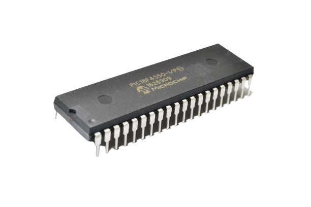
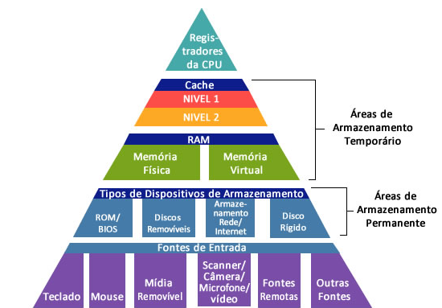
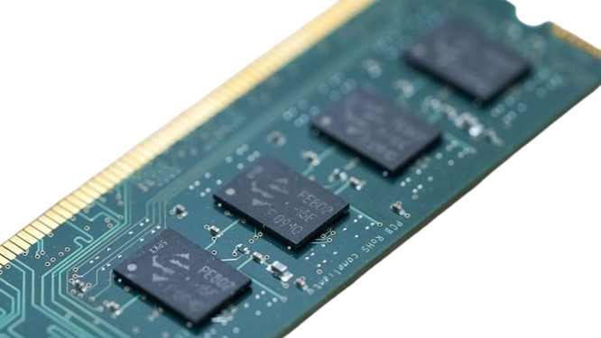
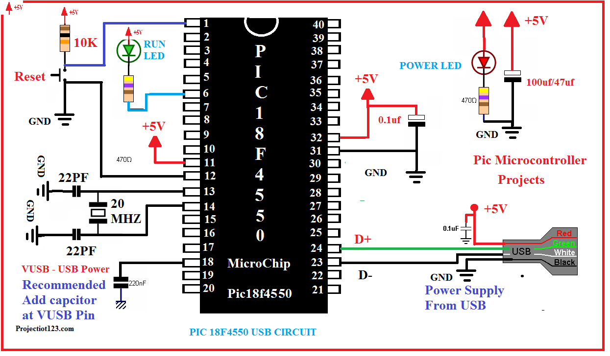

**EEM1 - programa para o PIC18F4550**

**1 - Ciclo de máquina de um microcontrolador**

tempo para excecução de tarefas básicas

Frequência do Clock: A taxa na qual o microcontrolador opera, medida em MHz ou GHz.

Número de Ciclos de Clock por Instrução: Quantos ciclos de clock são necessários para completar uma instrução.

Pipeline e Arquitetura: Técnicas que podem reduzir o número de ciclos necessários.

Memória e Barramento de Dados: Acesso rápido à memória e barramentos mais largos podem melhorar o desempenho.

O tempo de um ciclo de máquina pode ser calculado como:

Tempo do Ciclo de Máquina = 1 / Frequência do ClockTempo

Instruções que exigem múltiplos ciclos de clock têm seu tempo total calculado multiplicando o número de ciclos pelo tempo do ciclo de máquina.

** 2 - memória volátil e a memória não-volátil**

Volátil: quando seu conteúdo é perdido ou apagado assim que a energia é cortada. Nesse caso, a memória perde a sua função e para de funcionar.

Não volátil: quando são capazes de continuar memorizando, mesmo sem a presença da energia (quando o sistema é desligado).

**3 - o tipo de armazenamento em memórias PIC é o armazenamento Flash**

**4 - A capacidade de armazenamento de um microcontrolador com 16 bits de endereçamento é de 64 KB porque:**

16 bits de endereçamento permitem 2^(elevado)a 16 endereços distintos, o que equivale a 65.536 endereços.
Cada endereço normalmente armazena 1 byte.
capacidade total é de 65.536 bytes, que se convertem em 64 KB.

**DATASHEET e informações relevantes**

Número de Endereços: Com 16 bits de endereçamento, o número total de endereços possíveis é 2^16 = 65.536 ou 64kb.

Tamanho de Cada Unidade de Armazenamento:O endereço refere-se a um byte (8 bits) de dados. (8*8=64kb)

 I/O (entrada e saída digital): 35

Porta A: 6 pinos (RA0 a RA5)
Porta B: 8 pinos (RB0 a RB7)
Porta C: 8 pinos (RC0 a RC7)
Porta D: 8 pinos (RD0 a RD7)
Porta E: 3 pinos (RE0 a RE2)
Porta F: 7 pinos (RF0 a RF7) - podem ter funções específicas ou restrições de uso.
Porta G: 5 pinos (RG0 a RG5) - podem ter funções específicas ou restrições de uso.

6+8+8+8+3+7+5=45 pinos I/O digitais, mas devido as restrições e funções especiais não são todos que podem ser utilizados.

para entrada analógica pode ser utilizados os pontos de acesso:
    Porta A:
        RA0/AN0
        RA1/AN1
        RA2/AN2/VREF-
        RA3/AN3/VREF+
        RA5/AN4/SS

    Porta B:
        RB0/AN12/INT0/FLT0
        RB1/AN10/INT1
        RB2/AN8/INT2
        RB3/AN9/CCP2

    Porta E:
        RE0/AN5/CK1SPP
        RE1/AN6/CK2SPP
        RE2/AN7/OESPP

    Porta F:
        RF0/AN5/CVREF
        RF1/AN6
        RF2/AN7
        RF3/AN8
        RF4/AN9
        RF5/AN10
        RF6/AN11
        RF7/AN12

totalizando 13 pinos que podem ser configurados com entrada analógica devido a presença de multiplexadores analógicos que conectam os pinos aos módulos de conversão analógica (adc) que faz a conversão de analógico para digital.
pontos analógicos podem ser referência tensioonal sendo localizado como (VREF+ e VREF-)

**PIC18F4550 utiliza uma arquitetura RISC (Reduced Instruction Set Computer).**

processadores embutidos e sistemas onde a eficiência, a previsibilidade do desempenho e a simplicidade precisam ter a arquitetura RISC, para melhor funcionamento das atividades.

** PIC18F4550 suporta  + de 75 instruções sequênciais**

acessando a memória d entrada e saída (E/S), possui um total de 7 portas disponíveis (Porta A até Porta G), com um total de 45 pinos que podem ser configurados como entradas ou saídas digitais.

**resistor PULL-UP**
Um resistor de pull-up é usado em circuitos eletrônicos para garantir que um sinal de entrada em um pin (pino) de um dispositivo (como um microcontrolador) seja mantido em um estado lógico alto (1) quando nenhum outro dispositivo está forçando o pino para um estado específico.

**Ativar - resistor de Pull-up no PIC18F4550**
necessário configurar o bit RBPU (Pull-up Enable bit) no registrador INTCON2.

**ASSEMBLY**
"bsf INTCON2, RBPU ; Ativa os resistores de pull-up internos da Porta B"

**C(BIBLIOTECA > MPLAB XC8)**
INTCON2bits.RBPU = 0; // Ativa os resistores de pull-up internos da Porta B

Esses comandos configuram o bit RBPU no registrador INTCON2 para ativar os resistores de pull-up internos da Porta B do PIC18F4550.

**REGISTRADORES PIC18F4550 e suas funções**

TRISA (Tris register A): usado para configurar os pinos da Porta A (RA0 a RA5) como entradas ou saídas.

PORTD (Port D Data Register): usado para escrever dados nos pinos da Porta D (RD0 a RD7) quando eles estão configurados como saídas, ou para ler os dados presentes nesses pinos quando eles estão configurados como entradas. 

TMR2 (Timer2 Register): armazena o valor atual do contador do Timer2.

T1CON (Timer1 Control Register): usado para controlar as configurações e operações do Timer1

**Interrupção**

interrupção em um microcontrolador é um mecanismo que permite que o processador interrompa temporariamente a execução de um programa principal para lidar com uma condição ou evento especial, como entrada de dados de um temporizador.

